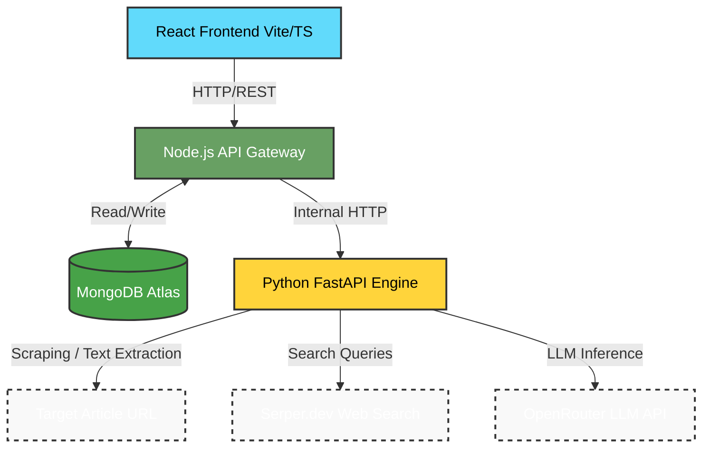
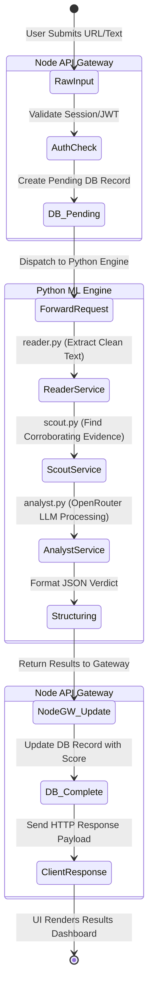

# System Architecture & Technical Documentation
**Project:** Article Fake Reality Checker  
**Role:** Senior AI/ML Solutions Architect  

## 1. Executive Summary & System Overview

The **Article Fake Reality Checker** is an enterprise-grade web application designed to combat misinformation by verifying the authenticity of news articles and digital content. By utilizing live web scraping, external fact-checking via search APIs, and large language models (LLMs) for deep contextual analysis, the system outputs a comprehensive "Reality Check" verdict.

**Architectural Pattern:** The application employs a **Microservices Architecture with an API Gateway pattern**. 
This separates concerns into three distinct tiers:
1. A stateless, Single Page Application (SPA) Client.
2. A Node.js API Gateway managing routing, authentication, state persistence, and client interfacing.
3. A decoupled Python-based AI/ML Engine strictly dedicated to heavy I/O operations (web crawling) and AI inference.

---

## 2. Tech Stack & ML Infrastructure

### Frontend Client
* **Framework:** React 18+ with TypeScript.
* **Build Tool:** Vite (for optimized HMR and fast production bundling).
* **Styling:** Tailwind CSS for a utility-first, responsive design system.

### Backend API Gateway
* **Runtime:** Node.js with Express.js.
* **Database:** MongoDB Atlas (via Mongoose ORM).
* **Authentication:** JSON Web Tokens (JWT) for stateless sessions and Passport.js for Google OAuth2 integration.
* **Role:** Acts as the traffic controller. It handles high-concurrency client requests, enforces rate limits, sanitizes inputs, persists user histories, and orchestrates calls to the Python Engine.

### AI/ML Infrastructure (Python Engine)
* **Framework:** FastAPI, utilized for its asynchronous capabilities (`asyncio`) which are crucial for non-blocking HTTP requests to external ML providers.
* **Scraping / Text Extraction:** Jina AI (inferred via `reader.py`) to bypass anti-bot protections, strip HTML, and extract clean semantic text from raw URLs.
* **Evidence Gathering:** Serper.dev API (`scout.py`) to perform live Google searches, gathering real-time corroborating or conflicting evidence.
* **ML Inference / NLP:** OpenRouter API (`analyst.py`) leveraging high-speed Llama models. The LLM is used as a zero-shot/few-shot classifier and textual entailment engine to weigh the article's claims against the scouted evidence.

**Architectural Rationale:** Node.js is optimal for handling asynchronous CRUD operations, auth, and thousands of concurrent lightweight connections. However, Node is not ideal for blocking operations or complex data pipelines. Offloading the NLP pipeline to Python ensures that heavy text processing and API polling do not block the event loop of the main API Gateway, ensuring a resilient and highly scalable system.

---

## 3. Component Breakdown & NLP Pipeline

Based on the repository tree, the core modules map to the following responsibilities:

* **`frontend/src/`**
  * `pages/` & `components/`: Pure presentation logic (e.g., `VerifyPage.tsx`, `ResultsDashboard.tsx`). 
  * `services/api.ts`: Centralized Axios client for querying the Node Gateway.
* **`backend/node-gateway/src/`**
  * `models/`: Defines the data structures (e.g., `FraudReport`, `VerificationHistory`, `User`, `GuestSession`).
  * `controllers/` & `routes/`: The HTTP interface. Maps RESTful endpoints (like `/api/fraud/verify`) to business logic.
* **`backend/python-engine/app/` (The NLP Pipeline)**
  * **`services/detector.py`**: The orchestrator. It receives the payload from Node.js and manages the execution flow of the pipeline.
  * **`services/reader.py` (Ingestion & Pre-processing)**: Takes a raw URL, fetches the DOM, removes boilerplate (navbars, ads), and tokenizes/cleans the text into a machine-readable string.
  * **`services/scout.py` (Data Augmentation)**: Extracts key entities and claims from the text, generating search queries to fetch external grounding data (live news, fact-checking sites).
  * **`services/analyst.py` (Inference)**: Constructs a highly structured prompt combining the original article text with the context gathered by the `scout`. It queries the OpenRouter LLM to perform logical deduction, generating a JSON response containing authenticity scores, detected bias, and specific red flags.

---

## 4. Data Flow & Interaction

The following outlines the lifecycle of a standard verification request:

1. **Client Submission:** A user submits an article URL or raw text via the React frontend.
2. **Gateway Reception:** The Node.js API Gateway receives the payload. It authenticates the user (or logs a Guest Session), validates the input format, and creates a "Pending" `VerificationHistory` document in MongoDB.
3. **Internal Dispatch:** The Gateway forwards the standardized payload via an internal HTTP POST request to the Python Engine's FastAPI endpoint.
4. **Text Extraction (`reader.py`):** If a URL was provided, the Python engine fetches and sanitizes the article's text.
5. **Evidence Scouting (`scout.py`):** Key claims are passed to a search API to retrieve external, real-world context.
6. **LLM Analysis (`analyst.py`):** The clean text and external context are passed to the OpenRouter LLM. The model performs textual entailment and outputs a structured JSON assessment.
7. **Persistence:** The Python Engine returns the JSON payload to the Node.js Gateway. The Gateway updates the `VerificationHistory` record in MongoDB from "Pending" to "Completed", attaching the results.
8. **Client Response:** The Gateway forwards the final Reality Check verdict to the frontend, where the React components render the visual dashboard, scores, and evidence breakdown.

---

## 5. Architecture Diagrams

### System Architecture Flowchart

### Data Flow Diagram (DFD)

